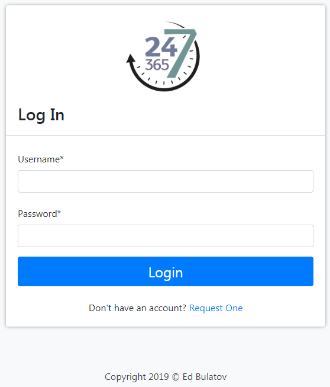
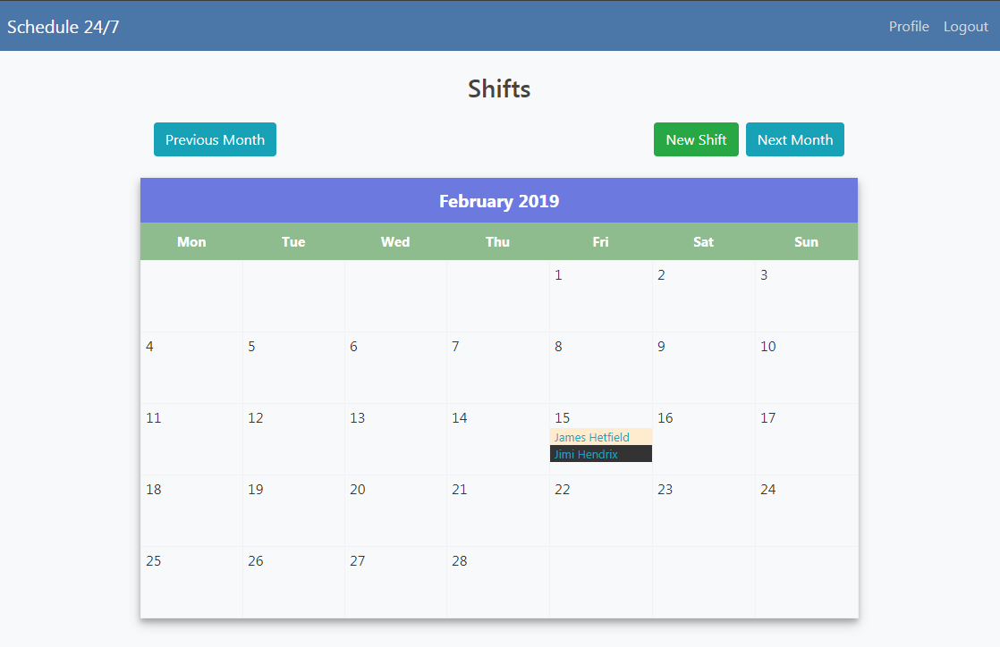

## Django/python web application in Docker for employees shift and schedule management
Also can be used as calendar notebook. 

Example of deploying in Google Cloud Platform is below.

Need to install [docker](https://docs.docker.com/install/), 
[docker-compose](https://docs.docker.com/compose/install/) 
and [docker-machine](https://docs.docker.com/machine/install-machine/) before running this app.

```
docker-machine create --driver google \
--google-project your_project_id \
--google-zone europe-west3-c \
--google-machine-type f1-micro \
--google-machine-image $(gcloud compute images list --filter ubuntu-1604-lts --uri) \
docker-vm
```
Once VM instance is up, change your local environment to use docker on remote machine:

```eval $(docker-machine env docker-vm)```

After this command, all docker tasks will be executed on remote VM host. To check that, type:

```docker-machine ls```

ACTIVE field should be marked by asterisk (*)

Don't forget to edit VM instance in Google Cloud Compute Engine GUI and allow HTTP traffic for this app.

### Now run our web application:

```docker-compose up -d```

Once everything is done, 3 docker containers will be active: main application, nginx and postgresql. To verify, type:

```docker ps -a```

Status of all containers should be "up". To create admin user for application, execute:

```docker exec -ti app_container /bin/bash```

Inside of container:

```python manage.py createsuperuser```

Follow instructions. After admin creation, open external IP of our VM instance in browser and enjoy.



Admin interface is available by ```http://your_IP/superadm```

Main page with our calendar and with some added data:


